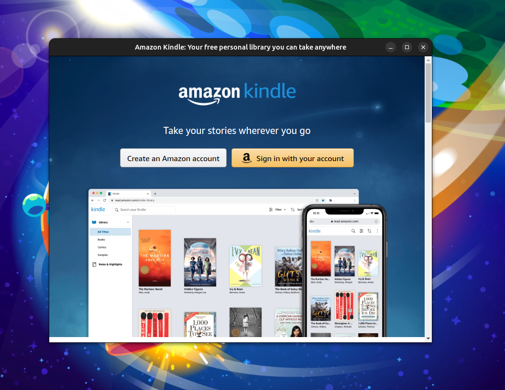

# Kindle App for ubuntu



A simple Kindle desktop app for Ubuntu (or derived distros) based on electron js.

Install it easily and start reading on your Linux desktop. 

## Install

To install this application, you need

- [Ubuntu](https://ubuntu.com/) based distros
- [Gnome](https://www.gnome.org/) or [KDE](https://kde.org/)
- [nodejs](https://nodejs.org/en)
- [npm](https://www.npmjs.com/)

Then run at your terminal:
```bash
mkdir -p ~/kindle
git clone https://github.com/Dpbm/Kindle-for-ubuntu.git ~/kindle
cd ~/kindle
chmod +x ./install.sh
./install.sh
```
within a few seconds, the Kindle icon will appear on your applications hub.

## Uninstalling

To uninstall it you may run:

```bash
cd ~/kindle
chmod +x uninstall.sh
./uninstall.sh
```

## Other Versions

This small application is based on Kindle's web version, so your experience will differ a lot from its mobile usage.

Due to that, [@SugarRayLua](https://github.com/SugarRayLua) shared a step-by-step tutorial on [this issue](https://github.com/make-install-linux/Kindle-for-ubuntu/issues/1) showing how to use the windows app on Linux, [check it out](https://github.com/make-install-linux/Kindle-for-ubuntu/issues/1#issuecomment-2558387213).

Thanks [@SugarRayLua](https://github.com/SugarRayLua) 🙏🙏🙏!!